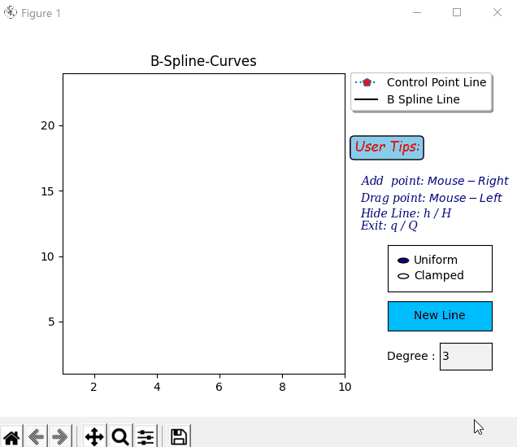

# B-Spline-Curve
a tiny and fast B-spline curve  which support user  interaction.
Go to [B-spline](https://en.wikipedia.org/wiki/B-spline "wiki") for more details.
## Demo

## Install
    pip install -r requirements.txt
## Usage
    python main.py
## Features
* **Interactive**: Use mouse left and mouse right you can add control point and drag control line.
* **Two types B-spline**: Support Uniform and Clamped type B-spline.
* **Define Curve's degree**: You can input what you want degree of the curve but make sure that you input is valid.

## Todo list
* **Add delete Point**
* **Add delete Line**